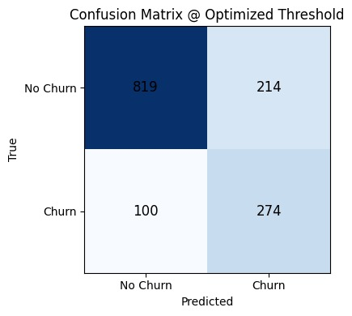
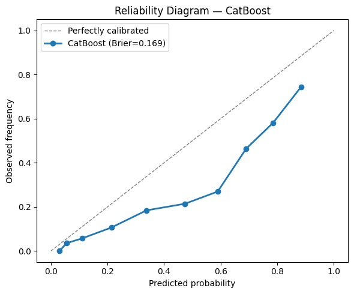
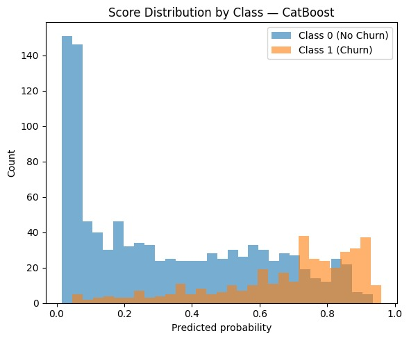
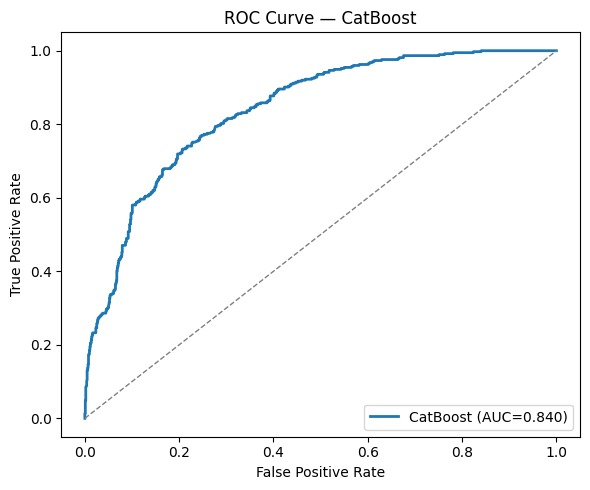
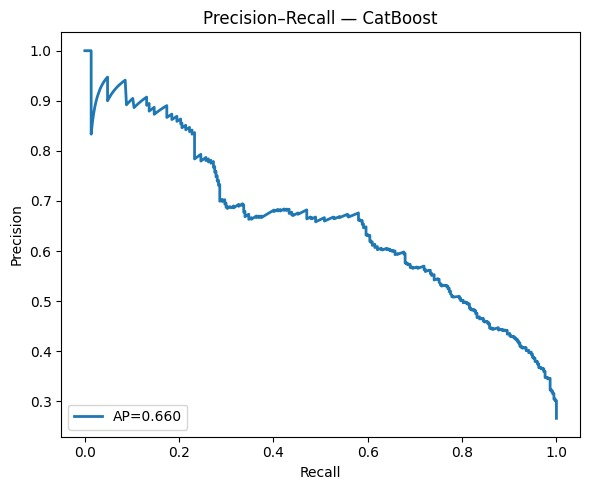
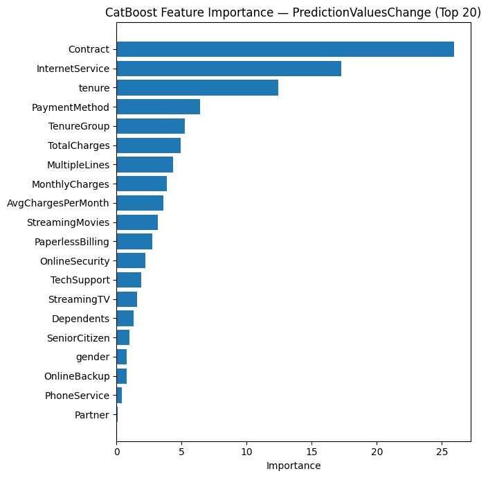
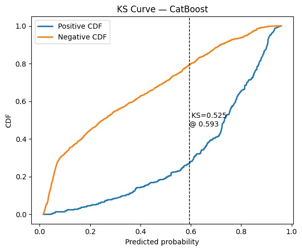

# 📊 Customer Churn Prediction – SRM Case Study (21AIC401T)

**Course:** Inferential Statistics and Predictive Analytics  
**Department:** Computational Intelligence, School of Computing, SRM University  
**Assignment Type:** Case Study-Based Modeling Project  


---

## 🎯 Objective
To design, develop, and evaluate a **Customer Churn Prediction Model** using a hybrid approach that combines:
- **CHAID Rule Induction** → for interpretable rule-based insights  
- **CatBoost / Calibrated XGBoost** → for high predictive accuracy and probability calibration  

The goal is to identify customers most likely to churn and provide data-driven recommendations to minimize churn.

---

## 🧩 Dataset
- **Source:** [Kaggle – Telco Customer Churn Dataset](https://www.kaggle.com/blastchar/telco-customer-churn)  
- **File Used:** `WA_Fn-UseC_-Telco-Customer-Churn.csv`  
- **Target Variable:** `Churn` (Yes/No)  
- **Additional Data:**  
  - `chaid_rules.csv` → extracted rule-based segmentation from CHAID tree  

The dataset includes information on customer demographics, contract types, billing methods, and service usage.

---

## 🧮 Workflow Overview

### 1️⃣ Data Preparation
- Cleaned the `TotalCharges` column and handled missing rows.  
- Encoded the `Churn` column (1 = Yes, 0 = No).  
- Normalized categorical variables like `InternetService`, `Contract`, and `PaymentMethod`.  

---

### 2️⃣ CHAID Rule Induction
- Extracted decision rules for interpretability.  
- Key patterns identified:
Contract = Month-to-month → Churn ≈ 58%
Contract = Two-year → Churn ≈ 3%
PaymentMethod = Electronic check → High churn likelihood
- File: [`data/chaid_rules.csv`](data/chaid_rules.csv)

---

### 3️⃣ Model Development – CatBoost / Calibrated XGBoost
The final predictive model integrates **CatBoost’s categorical handling** and **XGBoost’s calibration** for improved reliability.

- **Trained Model:** `models/best_XGBoost_calibrated.pkl`
- **Notebook:** `Case_Study_ISPA.ipynb`

**Highlights:**
- Handles categorical data natively (no one-hot encoding)
- Automatically adjusts for class imbalance  
- Produces **well-calibrated churn probabilities** suitable for deployment  

---

## 📊 Evaluation Metrics

| Metric | Value |
|---------|--------|
| **ROC-AUC** | 0.840 |
| **Average Precision (AP)** | 0.660 |
| **Brier Score** | 0.169 |
| **KS Statistic** | 0.525 |
| **Best Threshold (J-statistic)** | 0.593 |
| **True Positive Rate (TPR)** | 0.733 |
| **False Positive Rate (FPR)** | 0.207 |
| **Confusion Matrix** | TN: 819 FP: 214 FN: 100 TP: 274 |

📁 Stored under:  
- [`artifacts/metrics.json`](artifacts/metrics.json)  
- [`artifacts/overall_metrics.csv`](artifacts/overall_metrics.csv)  
- [`artifacts/confusion_matrix_at_J.csv`](artifacts/confusion_matrix_at_J.csv)  
- [`artifacts/roc_curve.csv`](artifacts/roc_curve.csv)  
- [`artifacts/pr_curve.csv`](artifacts/pr_curve.csv)

---

## 📈 Model Evaluation Visuals

### 🧮 1. Confusion Matrix @ Optimized Threshold


---

### 📏 2. Reliability Diagram – Calibrated Model


---

### 📊 3. Score Distribution by Class


---

### 📈 4. ROC Curve (AUC = 0.84)


---

### 🔁 5. Precision–Recall Curve (AP = 0.66)


---

### 🧠 6. Feature Importance (Top 20)


---

### 📉 7. KS Curve (KS = 0.525 @ 0.593)


---

## 🔍 Key Business Insights

| Factor | Impact on Churn |
|---------|----------------|
| **Contract** | Month-to-month → Highest churn rate |
| **Tenure** | Lower tenure = higher churn |
| **PaymentMethod** | Electronic check users churn more |
| **OnlineSecurity / TechSupport** | Reduce churn probability |
| **Fiber Optic Internet** | Slightly higher churn due to pricing sensitivity |

**Actionable Recommendations:**
- Incentivize customers to switch from month-to-month to annual contracts.  
- Offer retention perks to short-tenure or high-value customers.  
- Encourage digital autopay methods instead of electronic checks.  
- Bundle online security and tech support with plans.

---

## 🚀 Deployment Example (Flask API)

```python
import flask, joblib, pandas as pd
app = flask.Flask(__name__)
model = joblib.load('models/best_XGBoost_calibrated.pkl')

@app.route('/predict', methods=['POST'])
def predict():
  data = pd.DataFrame([flask.request.get_json()])
  data = data.drop('customerID', axis=1, errors='ignore')
  pred = model.predict(data)[0]
  prob = model.predict_proba(data)[0, 1]
  return flask.jsonify({
      'churn_prediction': int(pred),
      'churn_probability': float(prob)
  })

if __name__ == '__main__':
  app.run(debug=True)

